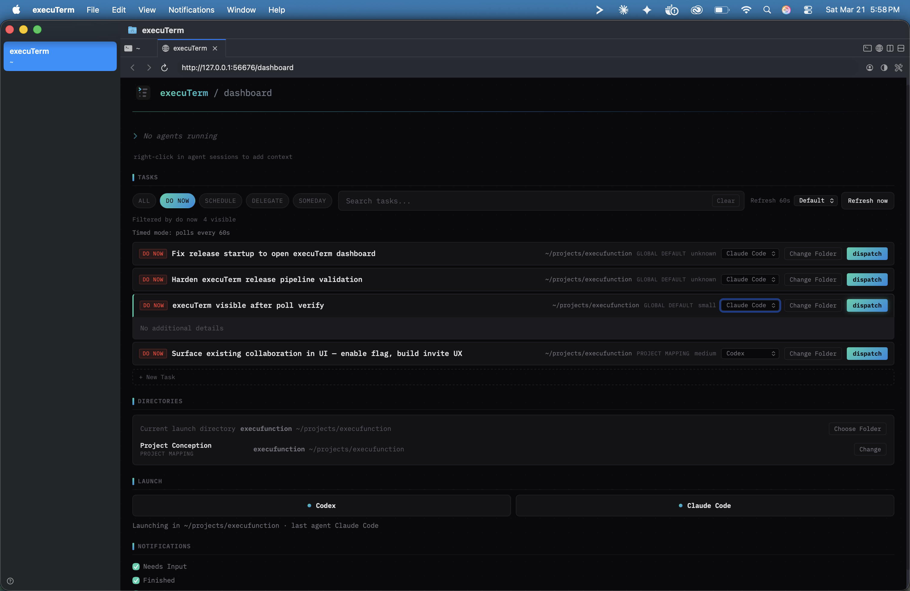
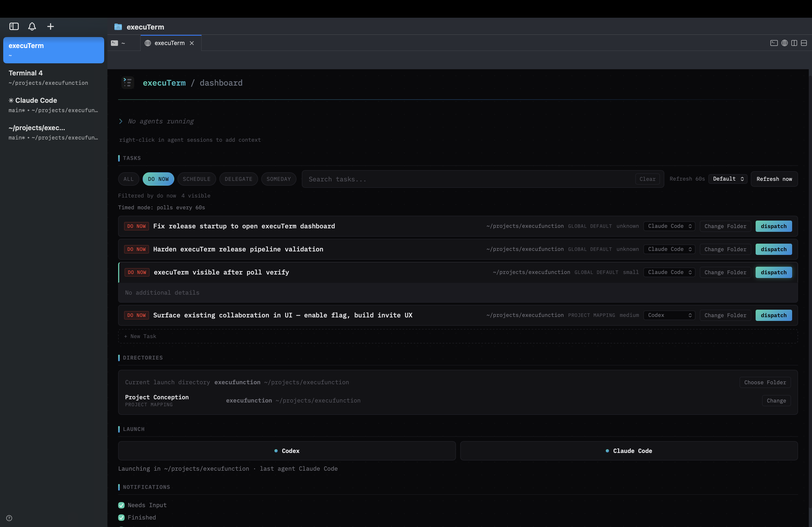
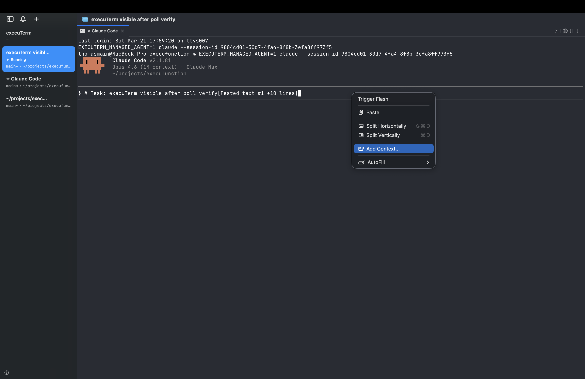
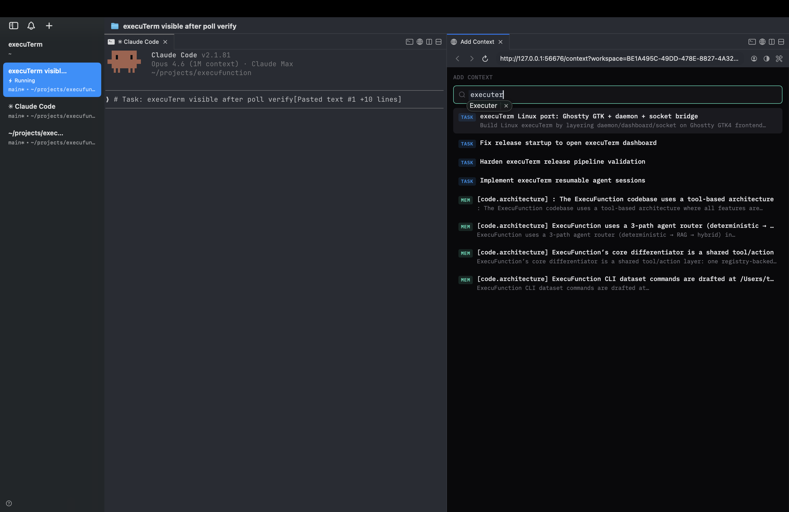
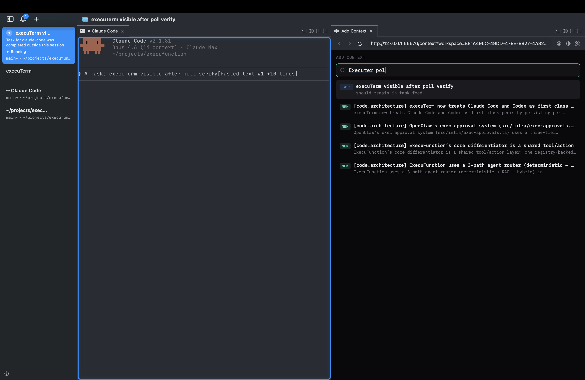
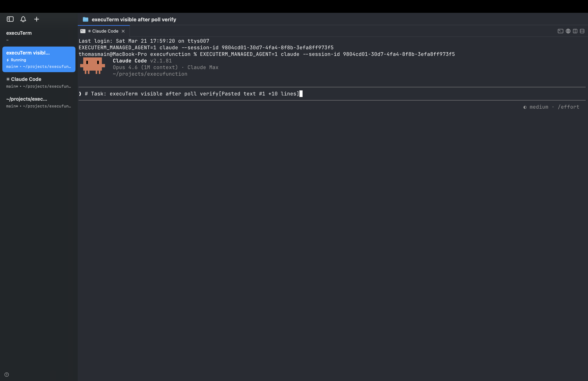

<h1 align="center">execuTerm</h1>

The terminal for developers who run AI agents.

  

  

---

execuTerm is a native macOS terminal built for running multiple AI coding agents simultaneously. It opens to a dashboard that shows your tasks, active agents, and workspaces in one view. You dispatch work from the dashboard, and execuTerm launches agent sessions, tracks their status, and notifies you when they need input.

Built with Swift and AppKit on top of [libghostty](https://github.com/ghostty-org/ghostty) for GPU-accelerated terminal rendering. Not Electron.

## What makes it different

**Dashboard-first.** execuTerm opens to a command center, not a blank shell. Your tasks, agent sessions, directories, and notifications are visible immediately. You launch agents from here and come back to check on them.

  

**Context injection.** Right-click any agent session to add context from your ExecuFunction workspace — tasks, code memory, notes, architecture decisions. The agent gets the context it needs without you copy-pasting.

  

  

**Semantic search across everything.** Search your tasks, code memory, and architecture docs to inject exactly the right context into an agent session.

  

**Agent lifecycle management.** Launch Claude Code, Codex, or any CLI agent from the dashboard. execuTerm tracks which agents are running, which are waiting for input, and which are done. Notification rings on panes and tabs tell you where to look.

  

## Core capabilities

- **Task dispatch** — Pick a task from your ExecuFunction board, assign an agent, and launch it in a new workspace
- **Notification system** — Pane rings and sidebar badges when agents need your attention. `Cmd+Shift+U` jumps to the latest unread
- **Vertical tabs + sidebar** — See git branch, working directory, listening ports, and notification state for every workspace at a glance
- **Split panes** — Horizontal and vertical splits. Run multiple agents side-by-side
- **In-app browser** — Split a WebKit browser alongside your terminal. Agents can interact with it via a scriptable API
- **Scriptable** — CLI and Unix socket API to create workspaces, split panes, send keystrokes, open URLs
- **ExecuFunction integration** — Connects to your ExecuFunction workspace for tasks, code search, knowledge, and context
- **Ghostty compatible** — Reads your existing `~/.config/ghostty/config` for themes, fonts, and colors
- **Auto-updates** — Ships with Sparkle. Download once, stay current

## Install

Open the DMG, drag execuTerm to Applications. That's it. Auto-updates handle the rest.

Requires macOS 14 (Sonoma) or later. Signed and notarized by Apple.

## Keyboard shortcuts

| Action | Shortcut |
|--------|----------|
| New workspace | `Cmd+N` |
| Jump to workspace 1–8 | `Cmd+1–8` |
| Toggle sidebar | `Cmd+B` |
| Split right | `Cmd+D` |
| Split down | `Cmd+Shift+D` |
| Focus pane directionally | `Opt+Cmd+Arrow` |
| New tab | `Cmd+T` |
| Notifications panel | `Cmd+I` |
| Jump to latest unread | `Cmd+Shift+U` |
| Open browser in split | `Cmd+Shift+L` |
| Find | `Cmd+F` |
| Settings | `Cmd+,` |

## How it connects

execuTerm ships with a local daemon that connects to [ExecuFunction](https://execufunction.com). On first launch, it authenticates via device flow and syncs your tasks, code memory, and project context. This is what powers the dashboard, task dispatch, and context injection.

You can also use execuTerm as a standalone terminal without ExecuFunction — it works as a fast, native terminal with vertical tabs and notifications regardless.

## Credits

execuTerm builds on [cmux](https://github.com/manaflow-ai/cmux) by Manaflow and [libghostty](https://github.com/ghostty-org/ghostty) by Mitchell Hashimoto. The terminal rendering, notification system, and scriptable API originate from that work. execuTerm extends it with the dashboard, ExecuFunction integration, agent dispatch, and context injection.

## License

AGPL-3.0-or-later. See [LICENSE](LICENSE) for full text.
